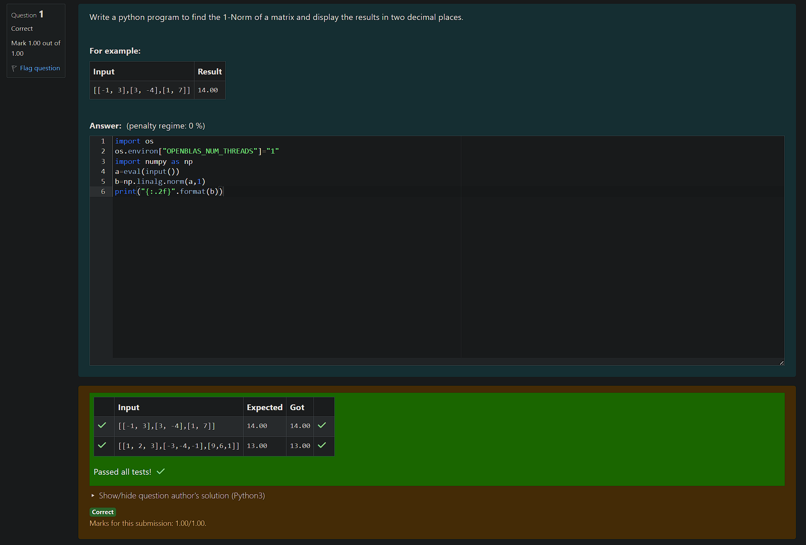
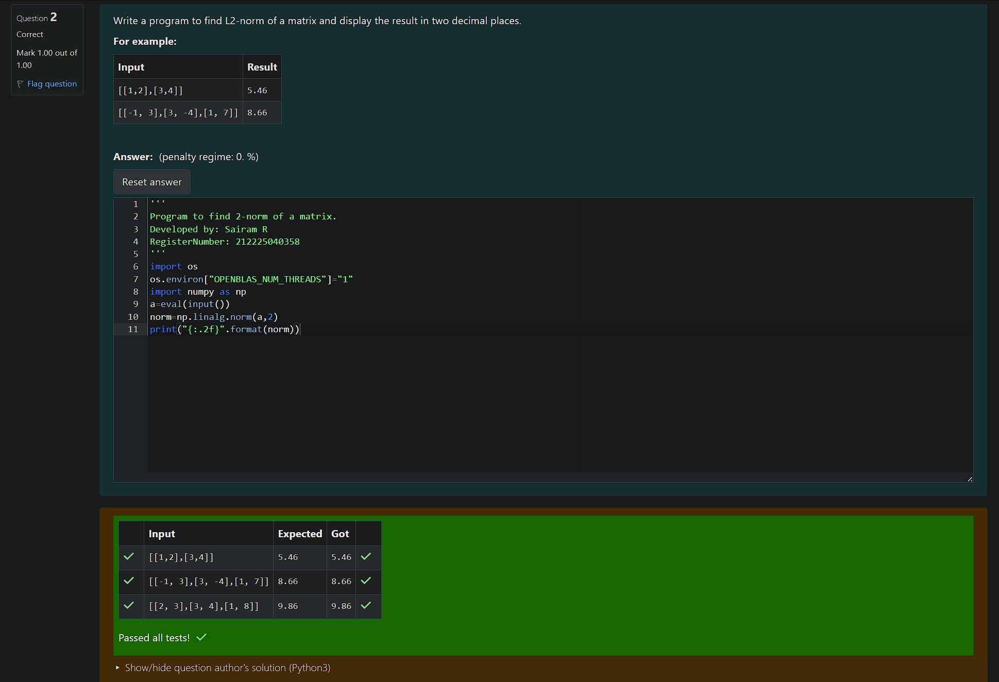
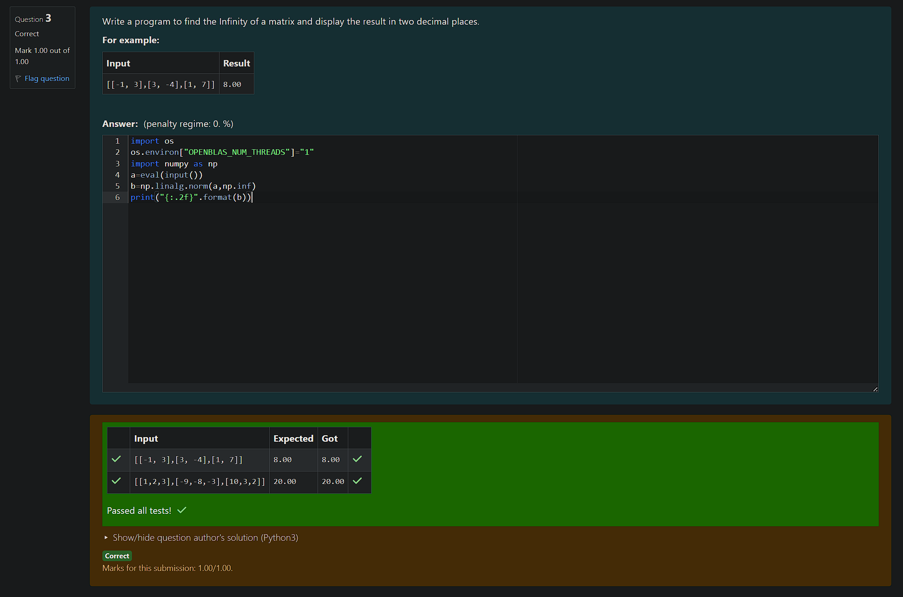

# Norm of a matrix
## Aim
To write a program to find the 1-norm, 2-norm and infinity norm of the matrix and display the result in two decimal places.
## Equipment’s required:
1.	Hardware – PCs
2.	Anaconda – Python 3.7 Installation / Moodle-Code Runner
## Algorithm:
	1. Get the input matrix using np.array()   
    2. Find the 2-norm of the matrix using np.linalg.norm()
	3. Print the norm of the matrix in two decimal places.
## Program:
```
# Register No:212225040358
# Developed By: Sairam R
```
# 1-Norm of a Matrix
```
import numpy as np
a=eval(input())
b=np.linalg.norm(a,1)
print("{:.2f}".format(b))
```


# 2-Norm of a Matrix
```
import numpy as np
a=eval(input())
norm=np.linalg.norm(a,2)
print("{:.2f}".format(norm))
```


# Infinity Norm of a Matrix

```
import numpy as np
a=eval(input())
b=np.linalg.norm(a,np.inf)
print("{:.2f}".format(b))

```
## Output:

### 1-Norm of a Matrix
<br>
<br>  
<br>

### 2-Norm of a Matrix
<br>
<br>
<br>

### Infinity Norm of a Matrix
<br>
<br> 
<br>

## Result
Thus the program for 1-norm, 2-norm and Infinity norm of a matrix are written and verified.
